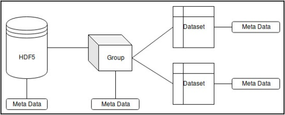

# DataProcessing in C++

## Technical Requirements
 * Modern C++ compiler with C++17 support
 * CMake build system version >= 3.8
 * ```Dlib``` library installation
 * ```Shogun``` toolbox library installation
 * ```Shark-ML``` library installation
 * ```Eigen``` library installation
 * ```hdf5lib``` library installation
 * ```HighFive``` library installation
 * ```RapidJSON``` library installation
 * ```Fast-CPP-CSV-Paser``` library installation

## Table Contents
 * [Comma Sperated Values (CSV)](#comma-seperated-values)
 * [JSON](#json)
 * [HDF5](#hdf5)


### Comma Sperated Values
 - The most popular format for representing structured data is called CSV. This format is just a text file with a two-dimensional table in it whereby values in a row are sperated with commas
 - The <b>advantages</b> of this file format:
   + A straightforward structure
   + Human-readable
   + Supported on a variety of computer platforms
 - The <b>disadvantages</b> of this file format:
   + A lack of support of multidimensional data and data with complex structuring
   + Slow parsing speed in comparison with binary format

### JSON
 - This is a file format with name-value pairs and arrays of such pairs
 - The <b>advantages</b> of this file format:
   + Human-readable
   + Supported on a variety of computer platforms
   + Possible to store hierarchical and nested data structures.
 - The <b>disadvantages</b> of this file format:
   + Slow parsing speed in comparison with binary format
   + Not very useful for representing numberical matrices

### HDF5
 - This is a specialized file format for storing scientific data and was developed to store heterogeneous multidimentional data with a complex structure. It provides fast access to single element because it has to optimized dta structures for using secondary storage and Supports data compression
 - The <b>advantages</b> of this file format:
   + Be high read-and-write speed, fast access to distinct elements
   + Be able to support data with a complex structure and various types of data
 - The <b>disadvantages</b> of this file format:
   + Requires of specialized tools for editing and viewing by users
   + The limited support of type conversions among different platforms
   + Uses a single file for the whole dataset
   + Impossible to restore data in the event of file corruption



